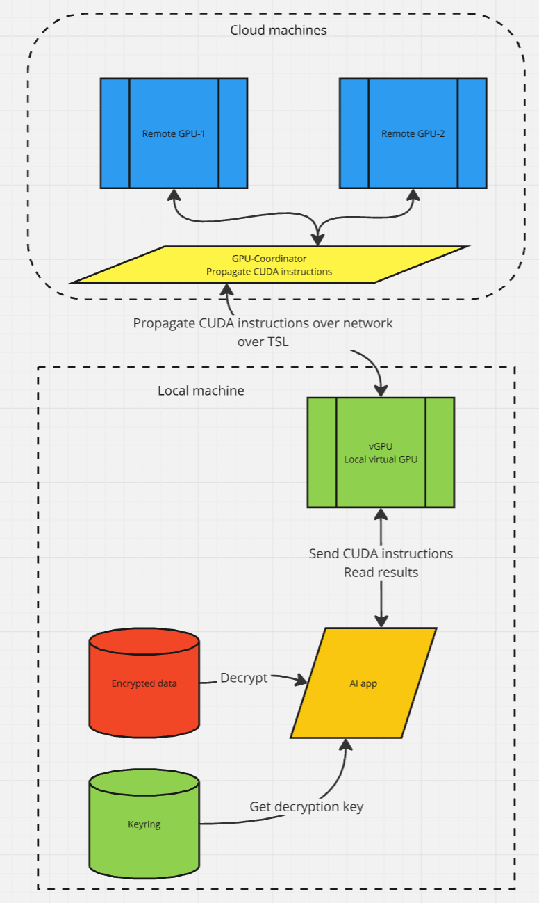

# rvirt-gpu

Virtualization for `GPU` that allows you to run local `GPU` apps and the code is actually ran in the cloud, keeping your data local, without changing your app, at least not much.

Functionality:
- `vGPU` is a `virtualization` layer for a `GPU`
- your local app "runs" on local `vGPU`
- local app decrypts the actual local data and sends the (`CUDA`) instructions to the remote `GPU-Coordinator`
- `GPU-Coordinator` distribute the instructions to multiple real `GPU`s
- then it sends the results back to `vGPU` which sends them to the local app

Three advatages emerge:

- You can execute AI models without haing a local GPU
- Execute on multiple GPUs, in the end, for some use cases, it could be faster than running on a local GPU
- Execute ML models without storing your data on untrusted providers. It will keep some blocks in memory which are needed for executing current instructions, but at least they are obfruscated and protected by OS not to be easily copied by other processes from memory. Data in transit is secured by TLS

# Wiki

[Wiki](https://github.com/radumarias/rgpu/wiki)

# Schema

# Credits

The main idea is of [Andrei Mărcuţ](https://github.com/andreimarcut).
